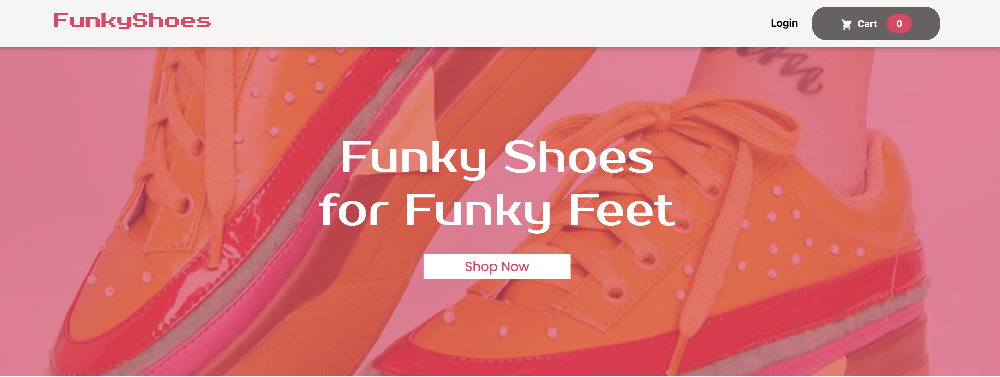

# **FunkyShoes**

## Table of Contents

- [Description](#description)
- [Deployed Web App](#deployed-web-app)
- [User Story](#user-story)
- [Getting Started](#getting-started)
- [Technologies](#technologies)
- [Future Improvements](#future-improvements)

## Description

---

FunkyShoes is a fun ecommerce website that allows the user to purchase funky shoes to match their funky personality.

## Deployed Web App

---

Check out our deployed web application below:

Deployed Website:https://dapper-croquembouche-b49505.netlify.app

## User Story

---

As a consumer, I am constantly struggling to find new shoe products that are unique. Funky Shoes keeps me up to date with new shoes that are fun and not a clone of previous models.

## Getting Started

---

Navigate throughout the page. Add items to the cart by clicking on the "ADD TO CART" button. If you no longer wish to purchase the items you had selected, simply click on the cart button from the header and click the trash can logo.

## Technologies

---

- React
- Node.js
- Express
- MongoDB
- Mongoose
- Firebase
- Bootstrap
- Material UI
- CSS
- Figma
- Google Fonts

## Future Improvements

---

For future improvements I will include...

- Individually delete items from the user's cart
- Add a specific quantity of an item
- Add a rating system from our users
- Add a order history for the users
- Add a search content by categories
- Add a navigation by category
- Add a search bar to search for individual items
- Add a functionality to sort items by price
